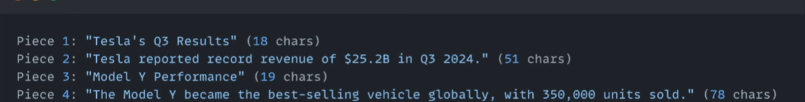
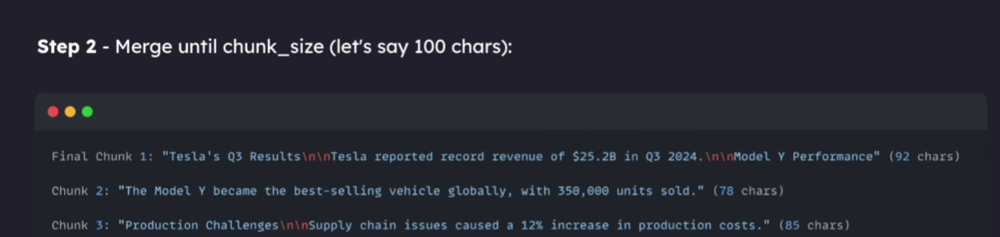

# The most basic technique of chunking is characterTextSplitter

## Type-1 [Character text-splitter]

It follows a split-first then merge second approach
It just split the paragraph based on the separators . By default it is \n\n
Then it check does the pieces are under the chunk_size . If the pieces below the chunk \_size. It try to merge pieces to make one chunk.
Take an example
Piece 1 -> Have 32 chars
Piece 2 -> Have 50 chars
And chunk_size is 100
It combine both the pieces to make one chunk
chunk -> P1 (20 chars) + P2(50 chars) < chunk_size

## Before Merging

## After Merging

## Drawback with the text-splitter

It does not split the text recursively
Take an example -
You set the chunk_size=100 and separator ='\n\n'

And you pass a single line ='line which have more than 100 characters'
Piece 3=150 chunks

You are not able to split it again even if it exceeds the chunk_size (Because there is only one single separator in the text-splitter)

## Type-2 [Recursive text-splitter]

#This Problem is being solved by the recursive-text-splitter which recursively split the piece with the list of priority separators

Original document
↓
Try "\n\n"
↓
Some piece > 100?
↓ YES
Try "\n"
↓
Still > 100?
↓ YES
Try " "
↓
Still > 100?
↓ YES
Split more aggressively

## Type-3 [Semantic text-splitter]

It is an expensive chunking process and is not often used.
Semantic chunking break up long document into meaningful pieces
It keep the piece together which are related to each other

It use AI embedding to find the similarity score between piece (That's why it is an expensive operation)
