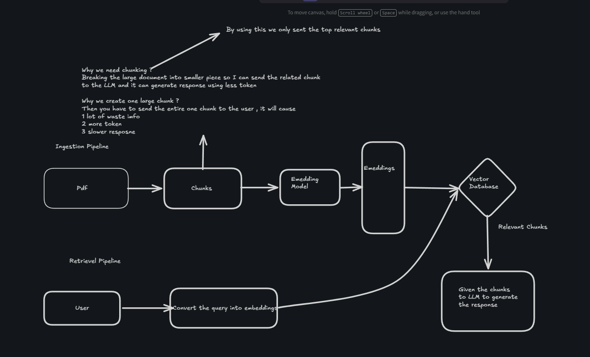

Cosine Similarity -> Just calculate the angle between 2 vectors

cos=A.N/(|A|\*|B|)
In the modern embedding model the embeddings vectors are normalized to 1 -> |A|=1
so cos=A.B
Information Thing - Give instruction to llm properly.

